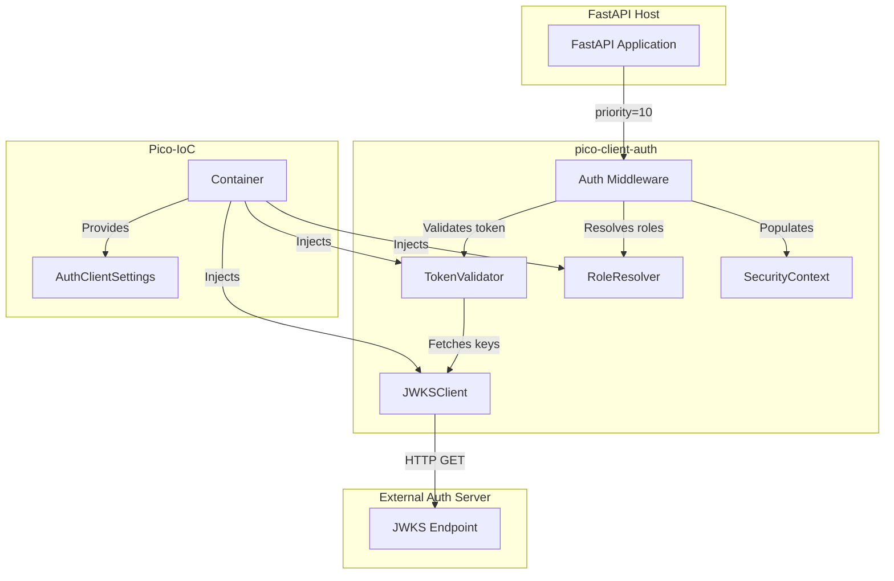
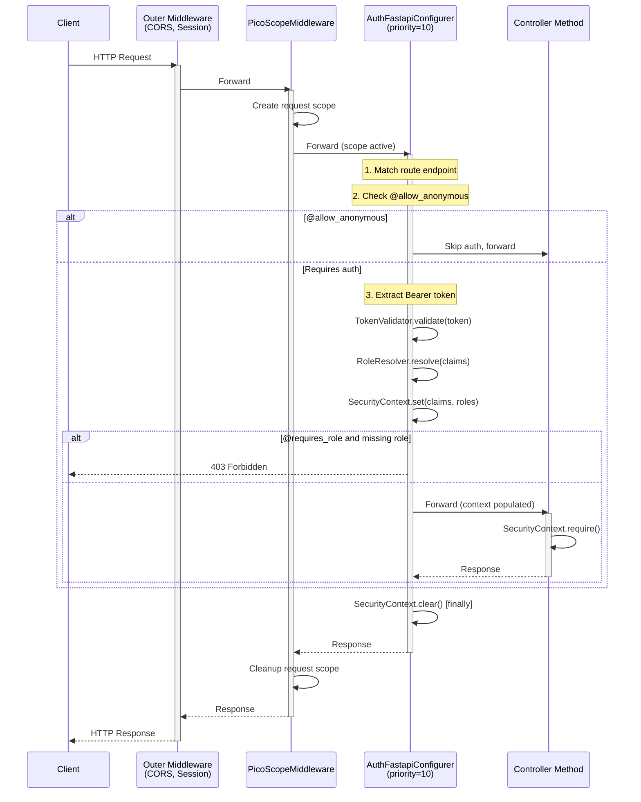
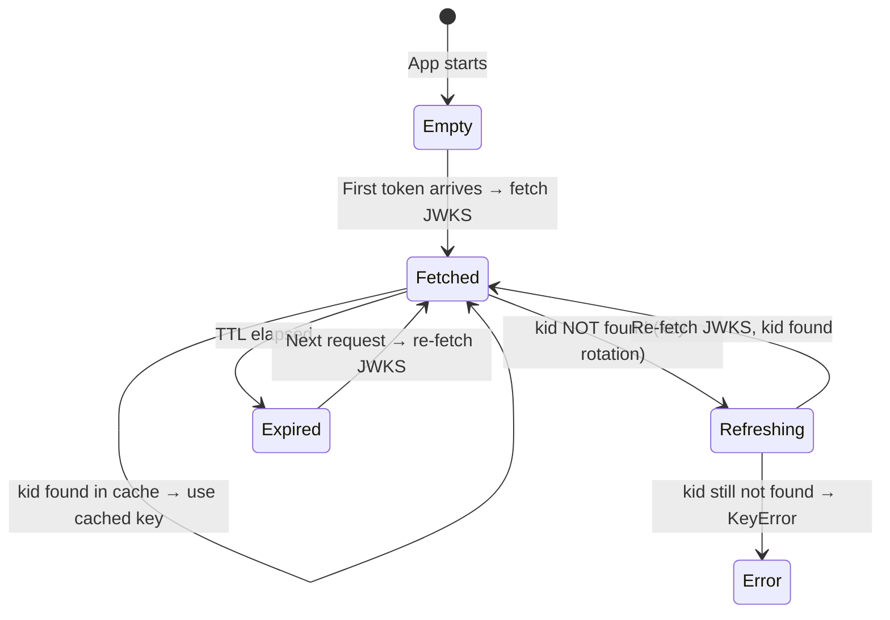
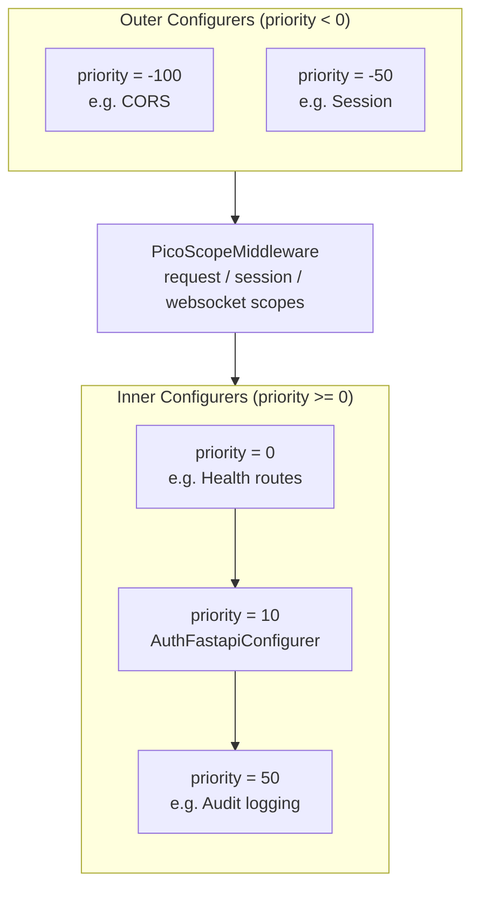
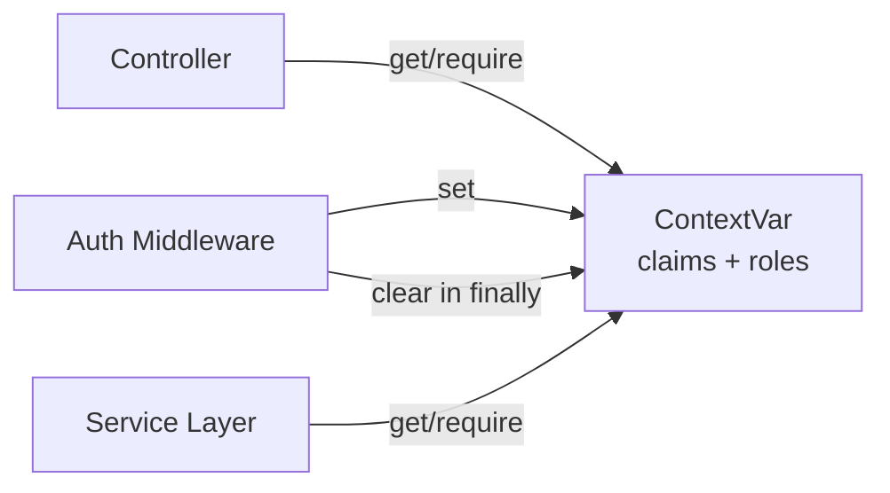

# Architecture Overview -- pico-client-auth

`pico-client-auth` is a thin authentication layer that sits between **pico-fastapi**'s middleware pipeline and your application controllers. Its purpose is to validate JWT tokens, populate a request-scoped `SecurityContext`, and enforce role-based access control.

---

## 1. High-Level Design

---

## 2. Request Lifecycle

---

## 3. Component Model

### Internal Components (not exported)

| Component | Type | Responsibility |
|-----------|------|----------------|
| `JWKSClient` | `@component` singleton | Fetch and cache JWKS with TTL |
| `TokenValidator` | `@component` singleton | Decode JWT, validate signature/issuer/audience |
| `DefaultRoleResolver` | `@component` fallback | Extract `[claims.role]` as default role list |
| `AuthFastapiConfigurer` | `@component` singleton | Register middleware, enforce config, wire pipeline |

### Public API (exported)

| Symbol | Type | Description |
|--------|------|-------------|
| `SecurityContext` | Static class | ContextVar-backed accessor for claims and roles |
| `TokenClaims` | `@dataclass(frozen=True)` | Immutable JWT claim fields |
| `allow_anonymous` | Decorator | Skip auth on endpoint |
| `requires_role` | Decorator | Require specific role(s) |
| `RoleResolver` | Protocol | Override role extraction logic |
| `AuthClientSettings` | `@configured` dataclass | Configuration from `auth_client` prefix |

---

## 4. JWKS Key Management

The `JWKSClient` caches all signing keys indexed by `kid`. When a token arrives with an unknown `kid`:

1. Force-refresh the JWKS cache (handles key rotation)
2. If the `kid` is still not found, raise `KeyError` (wrapped as `TokenInvalidError`)

---

## 5. Middleware Priority

`AuthFastapiConfigurer` uses `priority = 10`, placing it as an **inner** middleware (after `PicoScopeMiddleware`):

This means the auth middleware **has access to the pico-ioc request scope** and can resolve request-scoped services if needed.

---

## 6. SecurityContext Design

`SecurityContext` follows the Spring `SecurityContextHolder` pattern: a static class backed by `ContextVar` for async-safe, task-isolated storage.

Key properties:

- **Async-safe**: Each `asyncio.Task` gets its own copy (ContextVar semantics)
- **No dependency injection required**: `SecurityContext.require()` can be called from any code within the request
- **Always cleaned up**: The `finally` block in the middleware ensures no leakage between requests

---

## 7. Error Response Model

All authentication/authorization errors return JSON with a consistent schema:

| Status | Condition | Response Body |
|--------|-----------|---------------|
| 401 | No Bearer token | `{"detail": "Missing or invalid Authorization header"}` |
| 401 | Expired token | `{"detail": "Token has expired"}` |
| 401 | Invalid signature | `{"detail": "Invalid token: ..."}` |
| 403 | Missing role | `{"detail": "Requires one of roles: ['admin']"}` |

---

## 8. Architectural Intent

**pico-client-auth exists to:**

- Provide **secure-by-default** authentication for pico-fastapi apps
- Keep auth logic **out of controllers** (declarative decorators instead)
- Support **JWKS-based key rotation** without application restarts
- Enable **testable security** via `RoleResolver` override and container overrides

It does *not* attempt to:

- Implement OAuth flows (login, token issuance, refresh)
- Manage user sessions or cookies
- Replace a full identity provider
- Handle API key authentication
